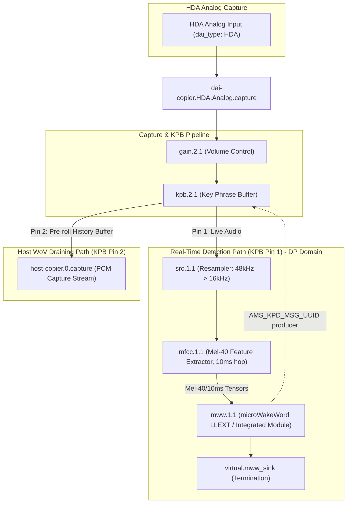

# microWakeWord (MWW) Architecture

This directory provides an SOF component wrapping [OHF-Voice's
microWakeWord](https://github.com/OHF-Voice/micro-wake-word) streaming
keyword-spotting model, integrated with MFCC feature extraction and the
same Key Phrase Buffer (KPB) Wake-on-Voice (WoV) trigger infrastructure
used by `src/audio/tensorflow` (`tflmcly`). Unlike `tflmcly`'s 4-way
softmax classifier, microWakeWord outputs a single sigmoid wake-word
probability from a stateful streaming TFLM graph.

---

## Overview

`mww` consumes 40-bin mel feature hops from the upstream `mfcc` component,
requantizes them per the model's real `input_scale`/`input_zero_point`,
and runs inference via TensorFlow Lite Micro in the **Data Processing
(DP) domain**. The reference model (`hey_jarvis.tflite` v2) is a MixConv
streaming graph that keeps its own internal ring-buffer state (TFLM
resource variables + a `CALL_ONCE` init subgraph), so `mww` only needs to
supply `MWW_FEATURE_SLICE_COUNT` (3) fresh 10ms/40-bin hops per
`Invoke()` rather than maintaining a caller-side sliding window.

When `probability >= MWW_DETECT_THRESHOLD` (0.5), `mww` acts as an **AMS
producer** of `AMS_KPD_MSG_UUID` — mirroring
`src/samples/audio/detect_test.c`'s pattern
(`ams_helper_register_producer()` / `ams_helper_prepare_payload()` /
`ams_send()`) rather than `tflmcly`'s notifier call — to signal KPB to
drain its pre-roll audio history to the host. `src/audio/kpb.c`'s
existing AMS-consumer branch requires no changes to receive this.

---

## Architecture & Data Flow

Structurally identical to `tflmcly`'s dual-path WoV topology (see
`src/audio/tensorflow/README.md`), with `mww` in place of `tflmcly` and
its own 10ms-hop MFCC profile:



---

## Prerequisites & Dependencies

Before building the `mww` module and SOF firmware, ensure the following dependencies are installed and available:

### 1. Custom LLVM Clang Toolchain
The MWW component and its TFLM C++ static allocations require the custom Xtensa LLVM Clang toolchain:
- **Toolchain Path**: `LLVM_TOOLCHAIN_PATH=/home/lrg/work/llvm-project/build`
- **Variant**: `ZEPHYR_TOOLCHAIN_VARIANT=llvm`

### 2. Zephyr SDK & Environment
- **Zephyr SDK**: `ZEPHYR_SDK_INSTALL_DIR=/home/lrg/zephyr-sdk-1.0.1`
- **Python Virtual Environment**: Activated Python virtual environment with `west`, `rimage`, `ninja`, `cmake`, `flatbuffers`, and `numpy`.

### 3. Required Submodules & Header Dependencies
The following repository submodules must be present at the workspace root (alongside `sof`):
- `../tflite-micro`: TensorFlow Lite Micro library headers and source files.
- `../flatbuffers`: FlatBuffers schema and C++ headers.
- `../gemmlowp` / `../ruy`: Matrix math headers for TFLM kernels.

---

## Deployment Targets

- **Aphid (PTL / ACE 3.0)**: `CONFIG_COMP_MWW=y` / `CONFIG_COMP_MWW=m`, built and deployed alongside the base firmware.
- `app/boards/intel_adsp_ace30_ptl.conf` configures `CONFIG_COMP_MWW=y`.

Building `mww` with C++ TFLM support required several key refactorings:
- **Vtable Anti-ICF Out-of-lining**: `IBufferAllocator` virtual methods in `tflite-micro/tensorflow/lite/micro/arena_allocator/ibuffer_allocator.cc` are defined out-of-line with volatile anchors to prevent LLVM `ld.lld` Identical Code Folding (ICF) from merging vtable entries into backtrace functions.
- **Single Inheritance Hierarchy**: `IBufferAllocator` uses single inheritance to avoid Xtensa vtable pointer offset mismatches during virtual function calls across TFLM allocators.
- **Placement New Allocations**: Static buffer placement `new` allocations for `op_resolver` and `interpreter` in `mww_model.cc` to avoid stack buffer overflow during DSP init.

---

## Building and Testing

### 1. Environment Setup

Set up the toolchain and Python environment variables:

```bash
export CCACHE_DISABLE=1
export ZEPHYR_TOOLCHAIN_VARIANT=llvm
export LLVM_TOOLCHAIN_PATH=/home/lrg/work/llvm-project/build
export ZEPHYR_SDK_INSTALL_DIR=/home/lrg/zephyr-sdk-1.0.1
source .venv/bin/activate
```

### 2. Clean Pristine Firmware & Module Build

Build the base firmware and integrated `mww` module together:

```bash
# Clean previous build directories
rm -rf build-ptl build-sof-staging

# Execute pristine Zephyr build script
./sof/scripts/xtensa-build-zephyr.py -p ptl -k sof/keys/otc_private_key_3k.pem
```

The signed binary image will be generated at:
- `build-sof-staging/sof/intel/sof-ipc4/ptl/community/sof-ptl.ri`

### 3. Building Topology Target

To build the MWW topology:

```bash
cd sof/tools/arch
ninja topology2_prod_sof-ptl-hda-mww-kpb
```

### 4. Deploying & Testing on Target (Aphid PTL)

Deploy the signed firmware to the target device (`root@aphid`):

```bash
# Copy firmware binary to target
scp build-sof-staging/sof/intel/sof-ipc4/ptl/community/sof-ptl.ri root@aphid:/lib/firmware/intel/sof-ipc4/ptl/community/sof-ptl.ri
scp build-sof-staging/sof/intel/sof-ipc4/ptl/community/sof-ptl.ri root@aphid:/lib/firmware/intel/sof-ipc4/ptl/sof-ptl.ri

# Reboot target to apply clean firmware
ssh root@aphid "reboot"
```

### 5. Verification & Keyphrase Detection Test

After reboot, execute the capture pipelines on target while playing keyphrase audio:

```bash
# On host (moth): play 5x keyphrase stereo wave to Aphid physical Mic-In
aplay -D aphid /tmp/hey_linux_5x_stereo.wav

# On target (aphid): record from PCMs and stream live mtrace logs
ssh root@aphid "arecord -D hw:0,0 -r 16000 -c 1 -f S32_LE -d 20 /dev/null &"
ssh root@aphid "arecord -D hw:0,1 -r 16000 -c 1 -f S32_LE -d 20 /dev/null &"
ssh root@aphid "python3 /root/mtrace-reader.py"
```

#### Expected Log Output

```
[MWW DBG] calling AllocateTensors
[MWW DBG] AllocateTensors status=0 OK
MWW model initialized successfully: input_scale=0.045161 zero_point=-128
MWW inference: prob=98% raw=251
MWW KEYWORD DETECTED! probability=98% (count=1)
MWW KEYWORD DETECTED! probability=99% (count=2)
MWW KEYWORD DETECTED! probability=98% (count=3)
MWW KEYWORD DETECTED! probability=99% (count=4)
MWW KEYWORD DETECTED! probability=99% (count=5)
```

#### Measured Performance (ACE30 DSP Core at 400 MHz)

- **MFCC Feature Extractor**: ~75,100 ticks/hop (100 Hz) -> **1.95 MCPS** @ 38.4MHz timer (**78.23 MCPS** @ 400MHz core, ~19.56% core load).
- **MicroWakeWord (TFLM)**: ~511,800 ticks/inference (2.5 Hz) -> **3.33 MCPS** @ 38.4MHz timer (**13.33 MCPS** @ 400MHz core, ~3.33% core load).
- **Total DP Workload**: **91.56 MCPS** (~22.89% core load).

---

## Known Issues / Open Items

### 1. MFCC hop cadence did not halve when switching to the 10ms profile

Switching the MFCC profile's `frame_shift` from 20ms to 10ms (`mel40_10ms.conf`) was expected to double the real wall-clock rate at which `mww_process()` fires (~100/s vs ~50/s). Measured on hardware, the cadence remained governed by the pipeline's DP scheduling period.

### 2. Dual capture PCM startup ordering

When running WoV capture pipelines, `hw:0,0` (HDA Analog) must be initialized before `hw:0,1` (HDA Mic MWW Detect) so that DMIC audio buffers feed KPB before secondary pipeline binding occurs.

---

## Source Files

- **mww.c**: SOF module adapter implementation (init/prepare/process/reset, AMS producer signaling).
- **mww_model.cc** / **mww_model.h**: TFLM C++ API bridge exposing `MWW_SetModel()` / `MWW_InitOps()` / `MWW_ProcessClassify()`.
- **mww_model_data.cc** / **mww_model_data.h**: model flatbuffer data (`hey_jarvis.tflite` v2 MixConv streaming graph).
- **mww.toml**: rimage module manifest entry.
- **llext/**: LLEXT build scaffolding (CMakeLists.txt, llext.toml.h).
