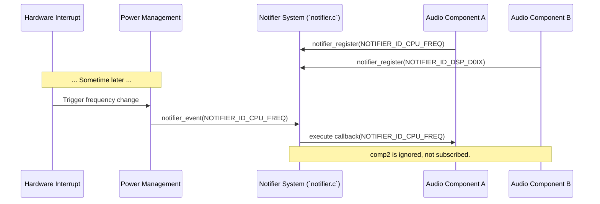
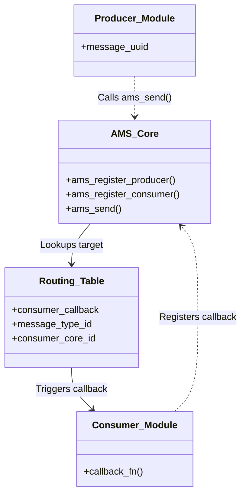

# SOF Core Libraries (`src/lib`)

The `src/lib` directory contains the foundational C libraries and shared services that run on the DSP. These modules provide the core infrastructure that higher-level audio processing components, IPC mechanisms, and scheduling domains rely on to function.

Unlike purely hardware-specific code (found in `src/platform`), the code here provides generic abstractions and software services.

## Core Subsystems

The library directory is roughly divided into hardware abstraction wrappers and pure software design patterns:

### 1. Software Services

- **Asynchronous Messaging Service (AMS, `ams.c`)**: A robust message-passing framework allowing decoupled communication between different software modules, especially across multi-core DSP topologies. Producers can register to send messages to consumers without needing direct function pointers, mediated optionally by Inter-Domain Communication (IDC) if crossing DSP cores.
- **System Notifier (`notifier.c`)**: A Publish/Subscribe (Pub/Sub) event system. Components can register callbacks for global state events (e.g., CPU frequency changes, DSP power state transitions, pipeline XRUNs). When `notifier_notify()` is called, all interested/registered parties are executed.
- **Object Pool (`objpool.c`)**: A generic block memory allocator optimized for extremely fast, fixed-size object allocation/freeing, mitigating heap fragmentation for core audio buffers.

### 2. Hardware Abstractions

- **DMA Manager (`dma.c`)**: Provides a unified API for managing Direct Memory Access (DMA) channels. It handles the acquisition, configuration, and freeing of hardware DMA resources abstracted away from the specific host or link DMA engines.
- **Clock Manager (`clk.c`, `cpu-clk-manager.c`)**: Centralized tracking for DSP CPU and peripheral clock frequencies, crucial for correctly calculating audio buffer timers and power management states.
- **DAI Wrapper (`dai.c`)**: Digital Audio Interface abstraction.

---

## Architectural Deep Dive

### System Notifier (Event Pub/Sub)

The System Notifier is critical for ensuring that disjoint parts of the firmware safely react to asynchronous hardware events.

### Asynchronous Messaging Service (AMS)

AMS is primarily used in IPC4 configurations to allow dynamically loaded modules to exchange side-band control data without breaking the strict audio processing graph.

When a message is sent across a multi-core boundary, `ams.c` internally translates the message into an Inter-Domain Communication (IDC) packet and pushes it to the target core's IDC interrupt handler, which reconstructs it and fires the consumer callback in the target core's context.
