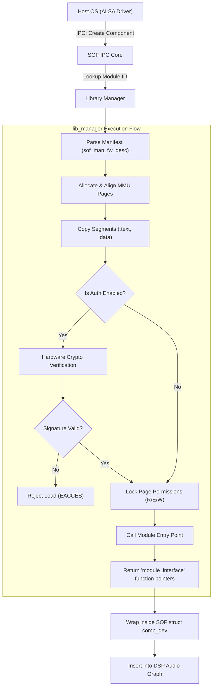

# Dynamic Library Manager (`src/library_manager`)

The `src/library_manager` directory provides the infrastructure for Sound Open Firmware (SOF) to dynamically load, link, authenticate, and execute external audio processing modules at runtime.

By utilizing dynamic libraries, SOF allows OEM vendors to write closed-source, proprietary DSP algorithms (like acoustic echo cancellation or smart amplifiers) and deploy them to the DSP without needing to recompile or modify the base open-source firmware image.

## Architecture

The library manager performs several highly trusted, low-level OS operations, bridging the gap between firmware and loadable ELF binaries.

It splits its duties between two main backends depending on the configuration and real-time OS support:

1. **Classic Standard Loader (`lib_manager.c`)**: Manually parses SOF-specific firmware manifests (`sof_man_fw_desc`), manages MMU page mappings, and extracts segments (.text, .rodata, .data, .bss).
2. **Zephyr LLEXT Manager (`llext_manager.c`)**: Integrates directly with Zephyr's native Linkable Loadable Extension (LLEXT) subsystem.

---

## Deep Dive: The Module Load Sequence

When the host driver attempts to initialize a pipeline containing a dynamically loadable module, the library manager intercepts the component creation request.

### 1. Memory Mapping and Extraction

The external library binaries are typically provided by the host into a shared DMA buffer (or pre-loaded into a specific memory storage region). The loader parses the ELF headers/manifest to extract the size of the logical sections (Code, Read-Only Data, Read-Write Data).

1. It allocates virtual memory space.
2. It copies the `.text` and `.rodata` sections, marking the MMU pages as Executable and Read-Only (`SYS_MM_MEM_PERM_EXEC` / `SYS_MM_MEM_PERM_RO`).
3. It maps the `.data` and `.bss` pages, marking them as Writable (`SYS_MM_MEM_PERM_RW`), zeroing out the `.bss` region.

### 2. Authentication (Optional)

If `CONFIG_LIBRARY_AUTH_SUPPORT` is enabled, the library manager passes the memory segment through the hardware cryptographic engine (e.g., Intel CSE) to verify that the library comes from a trusted, authorized signer before executing any code.

### 3. Execution Handoff

Once memory is staged, the manager resolves the entry point of the module and executes a `system_agent_start`. The library then returns a `module_interface` structure containing robust function pointers (`process()`, `reset()`, etc.), which the library manager uses to wrap the external code inside an SOF `comp_driver` adapter.

### Architecture Diagram

## Zephyr LLEXT Support

For Zephyr-based RTOS builds, `llext_manager.c` defers much of the heavy lifting to Zephyr's `llext_load()`. This subsystem inherently understands standard compile-time ELF relocation sections, allowing modules to be compiled normally (e.g., as position-independent code) and having Zephyr's kernel resolve the symbols dynamically at load time.

It also optionally attaches these modules to isolated Zephyr Memory Domains (`k_mem_domain`), providing userspace-level fault isolation, meaning a crashed external library will trigger a memory protection fault rather than bringing down the entire DSP firmware.
