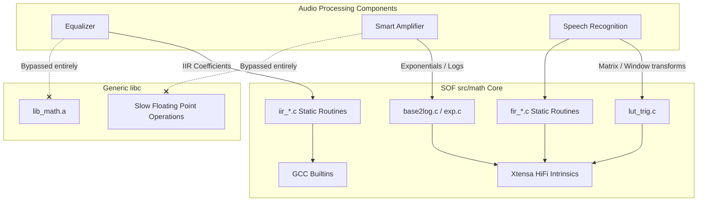

# SOF Core Mathematics

The `src/math` directory implements highly optimized, fixed-point DSP algebra and mathematical operations.

## Feature Overview

A core engineering restraint in embedded audio firmware is that Standard C Library floating-point math (`math.h`) algorithms executed on generic ALUs are drastically too slow to process high-definition audio in real-time, often lacking sufficient instruction cycle deterministic bounds and wasting battery life.

Instead, the SOF runtime eschews standard `libc` in favor of this `src/math` toolkit, which leverages intrinsic-heavy scalar arithmetic (e.g., Xtensa HiFi 3, HiFi 4, or GCC Builtins operations).

Core standalone functions include:

* **Logarithms & Exponentials**: `log_e.c`, `log_10.c`, `base2log.c`, `exp_fcn.c` - Specialized for high-precision $e^x$ and $\ln(x)$ transformations, critically used heavily in psychoacoustics (converting between linear and Mel scales).
* **Trigonometry**: `trig.c`, `lut_trig.c` - Sine and Cosine generators depending heavily on interpolated Look-Up Tables (LUTs) rather than runtime Taylor series expansions to save cycles.
* **Companding**: `a_law.c`, `mu_law.c` - Telecommunication algorithms for reducing the dynamic range of an audio signal, shrinking 16-bit linear PCM into ubiquitous 8-bit payloads for VoIP scenarios.
* **Signal Geometry**: `matrix.c`, `complex.c`, `window.c` - Provides foundational matrices for smart-array filtering along with Hann/Hamming overlap-add windows for Discrete Fourier transforms.

## Architecture and Dependency Integration

When a new audio component is instantiated (like an equalizer or a loud-speaker protector), it links against these optimized headers rather than attempting standard platform-independent calculations.

By concentrating all pure-math implementations directly inside `src/math`, new platform ports only need to rewrite a few core hardware intrinsic files to instantaneously optimize the arithmetic speed of every upstream audio component built into SOF.
