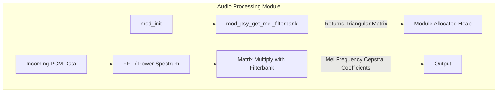

# Auditory Mathematics

The `auditory` subdirectory implements specific mathematical transformations designed to model human hearing and psychoacoustics. Unlike generic arithmetic or trigonometric functions, these modules map physical acoustic properties (like linear Hertz) into perceptual properties.

## Feature Overview

The core feature of this library is the **Mel Scale**. The Mel scale is a perceptual scale of pitches judged by listeners to be equal in distance from one another. Since the human ear is much more sensitive to differences in low frequencies than high frequencies, linear Hertz scaling is insufficient for many machine learning and advanced equalization tasks.

Capabilities supported:

1. `psy_hz_to_mel`: Non-linear transform of linear frequencies (Hz) into perceptual Mel units.
2. `psy_mel_to_hz`: Inverse conversion backing out from Mel units to linear Hz.
3. `mod_psy_get_mel_filterbank`: A generator that builds triangular overlapping bandpass filter matrices heavily used in feature extraction (like MFCCs for speech recognition).

## Algorithm and Architecture

To perform these conversions in a DSP environment without relying on slow, floating-point math libraries, the framework uses heavily optimized fixed-point arithmetic (like `ln_int32` and `exp_fixed` from the `log.c` and `exp_fcn.c` modules) manipulating `Q16.16` and `Q14.2` data structures.

### The Mel Filterbank Generator

When a processing module (like a keyword spotter or neural network) requires perceptual features, it doesn't calculate the Mel transform on every single audio sample. Instead, it generates a "filterbank" once during initialization.

`mod_psy_get_mel_filterbank` takes parameters for the desired frequency range (`start_freq`, `end_freq`) and how many distinct perception bands (`mel_bins`) the host algorithm wants. The logic walks through the requested bins, interpolating the slopes of the triangles sequentially to prevent redundant divisions.
