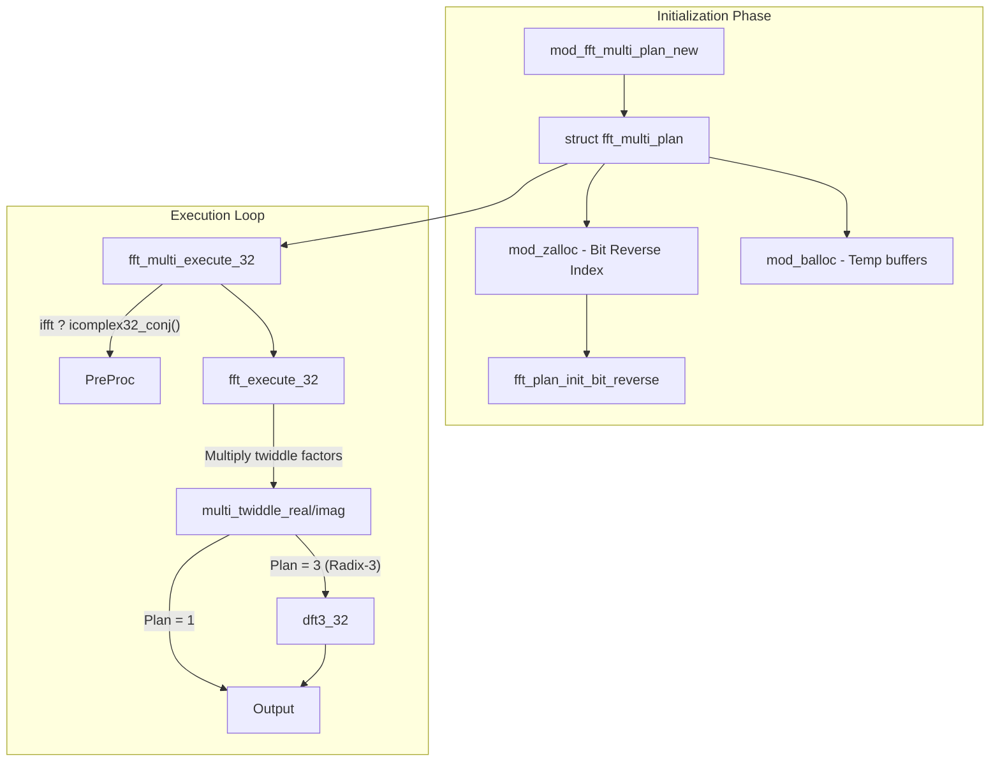

# Fast Fourier Transform (FFT) Mathematics

The `src/math/fft` directory handles operations that map real or complex signals spanning a time domain into a frequency spectrum domain, relying on specific hardware-accelerated DSP intrinsics (e.g. `fft_16_hifi3.c` utilizing optimized Xtensa HiFi 3 macros).

## Feature Overview

FFTs drastically reduce the computational complexity involved with Discrete Fourier Transforms (DFT) down to $O(N \log N)$ complexity. The SOF implementation handles variations in word length precision (16 bits vs 32 bits) and optimized radices (base $2$ vs base $3$ chunks).

Capabilities include:

1. **Power-of-2 Sizes**: Implementations covering standard buffer lengths (`FFT_SIZE_MIN` upwards).
2. **Multi-FFT Plan Architectures**: (`fft_multi.c`) Designed to run concurrent staggered instances spanning arrays, which are incredibly critical for overlapping-window spectrum analyses without duplicating heavy bit-reversal indexing overhead for every block.

## Algorithm and Architecture

The mathematics architecture revolves around the concept of a `fft_plan`. Instead of directly feeding a function with variables and watching it crunch values dynamically, the pipeline code provisions a planner struct (`mod_fft_multi_plan_new`).

By decoupling the layout and indices from the actual mathematical loop, the processor avoids recomputing heavy lookup constants during each real-time audio sample chunk, meeting strict sub-millisecond firm deadlines.

### Multi-FFT and Radix 3 Execution

When a caller requests an atypical length that isn't functionally bound $2^N$ (but happens to be neatly divisible by three like a $3N$ size), the multi-execution layer (`fft_multi_execute_32`) splits the FFT buffers sideways, executing identical hardware-optimized block lengths side-by-side using pre-instantiated pointer arrays (`tmp_o32[j][i]`), and concludes by performing a Size 3 cross-multiplied Discrete Transform spanning the result indices dynamically with twiddle scalars.
