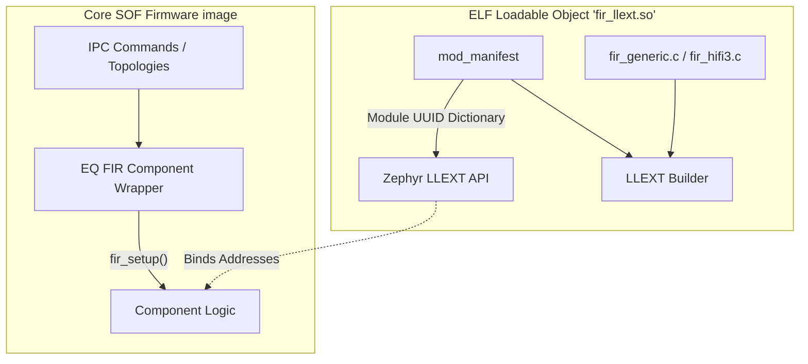

# Finite Impulse Response (FIR) Extensions

The `src/math/fir_llext` directory implements a mechanism to provide FIR generic algorithms to the DSP dynamically via the Zephyr **LLEXT (Loadable extension)** framework, rather than compiling it natively into the core firmware binary.

## Feature Overview

A Finite Impulse Response filter is a critical feature behind EQs, crossover processors, and data smoothing algorithms inside SOF. However, embedding all hardware-specific generic variations (Hifi3, Hifi4, GCC-builtins) of the convolution math directly increases the bare-metal kernel image footprint drastically and locks those variations in place.

The `fir_llext` module allows the application:

1. Separation of concerns. The mathematical heavy lifting `FIR` payload is built independently.
2. The core framework calls the math via defined component boundaries without knowing its physical static linkage footprint.

## Architecture

Instead of having a standard `.c` implementation providing an exposed C-Header mapping, `fir_common.c` creates a dedicated ELF wrapper exposing an auxiliary runtime manifest containing the distinct `SOF_REG_UUID(fir)` signature.

Upon boot, or module load request depending on the context, the Zephyr linker maps the `.module` sections containing `SOF_LLEXT_AUX_MANIFEST("FIR", NULL, SOF_REG_UUID(fir))` straight into the caller's memory scope without necessitating a full firmware redeployment.
