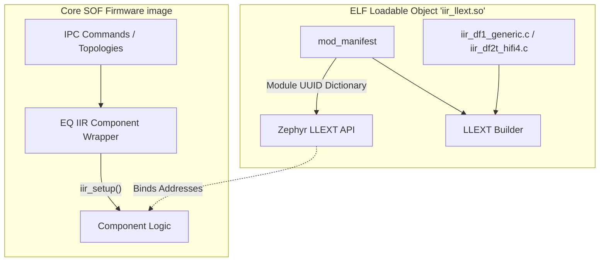

# Infinite Impulse Response (IIR) Extensions

The `src/math/iir_llext` directory implements a mechanism to inject highly optimized IIR (Infinite Impulse Response) algorithmic blocks into the DSP firmware at runtime, relying on Zephyr's **LLEXT (Loadable extension)** module framework.

## Feature Overview

Unlike the simple FIR calculations, IIR filters (like Biquads and Butterworth arrays) recursively mix previously calculated audio outputs back into the inputs, introducing significant floating point accumulator or fixed-point saturation complexities. These require careful hardware accelerations (like `HIFI3` vs `HIFI5` optimized routines).

By separating the IIR implementations into a distinct loadable payload, the module allows:

1. Dynamic testing of IIR topologies across different DSP architectures.
2. Saving significant bare-metal code sizes when IIR capabilities are not actually demanded by the topology.
3. Keeping complex math routines independent from standard IPC routing bugs.

## Architecture

The `iir.c` core defines an ELF manifest payload exposing the module's presence without building a hardcoded function table linking directly against the kernel headers.

The linker utilizes the explicit `SOF_REG_UUID(iir)` and builds the definitions around `SOF_LLEXT_AUX_MANIFEST`. This hooks the algorithm boundary straight across into the SOF Component API exactly like the complimentary FIR module structure does.
