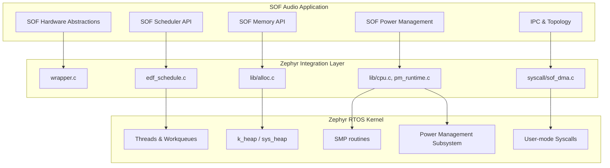
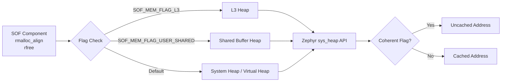

# SOF Zephyr Integration Architecture

The `sof/zephyr` directory contains the core integration layer between Sound Open Firmware (SOF) and the Zephyr Real-Time Operating System (RTOS). Zephyr is now the default RTOS for SOF (the legacy XTOS/HAL base is deprecated and is being removed). This directory implements the specific RTOS abstractions required for scheduling, memory management, power management, multicore CPU enablement, and system calls.

## Overview of Zephyr Integration

The integration replaces SOF's custom bare-metal concepts with standardized Zephyr alternatives:
1. **OS Wrapping**: Mapping interrupts, timestamps, and async messaging (`wrapper.c`).
2. **Scheduling**: Utilizing Zephyr's workqueues and thread definitions for tasks (`edf_schedule.c`).
3. **Memory Management**: Abstracting Zephyr's `k_heap` into SOF's memory allocation API (`lib/alloc.c`).
4. **CPU & Power**: Integrating SMP features for secondary core boot and connecting SOF's runtime PM to Zephyr's power states (`lib/cpu.c`, `lib/pm_runtime.c`).
5. **Hooks and Syscalls**: Safely exposing kernel objects (like DMA) to user-space components (`syscall/sof_dma.c`).

Below is the high-level architecture mapping SOF concepts to Zephyr kernel constructs.



---

## 1. System OS Wrapping (`wrapper.c`)

This file acts as the primary bridge linking SOF subsystem initializations and Zephyr Kernel hooks.

### Key Features
* **Boot Sequence**: Controls the boot flow mapping `start_complete()` to Zephyr state changes, notifying the IPC host when the DSP firmware is ready (`SOF_IPC4_FW_READY_LIB_RESTORED`).
* **Interrupt Management**: Overrides bare-metal interrupt registration with Zephyr's `arch_irq_connect_dynamic()`.
* **Timestamps & Wallclock**: Wraps hardware timer capabilities to provide precise `platform_dai_timestamp` for audio streams synchronization.
* **Fatal Errors**: Hooks into Zephyr's `k_sys_fatal_error_handler` to properly flush logs and send an IPC panic notification to the host before halting the DSP.

---

## 2. Memory Allocation (`lib/alloc.c`)

SOF maintains a sophisticated layered memory allocator architecture to handle multi-tiered DSP SRAM (e.g., L2, L3, virtual heap, un-cached memory).

### Architecture
`lib/alloc.c` links SOF's custom `rmalloc`, `rballoc_align`, and `rzalloc` functions directly into Zephyr's `sys_heap` subsystem.

* **System Heap (`sof_heap`)**: The primary heap mapped globally for core OS objects.
* **L3 Heap (`l3_heap`)**: Specialized memory for larger buffers (if hardware supports it). Re-uses Zephyr's heap logic but bounds it to IMR (Isolated Memory Region) bounds.
* **Virtual Heap (`virtual_buffers_heap`)**: For MMU-enabled architectures, utilizes the SOF VMH (Virtual Memory Heap) layered on top of Zephyr page tables.
* **Cache Coherency**: Wraps memory operations automatically translating `SOF_MEM_FLAG_COHERENT` into `sys_cache_uncached_ptr_get()` invocations where appropriate.



---

## 3. EDF Scheduling (`edf_schedule.c`)

Because the LL (Low Latency) and DP (Data Processing) schedulers are deeply tied to specific tight timers, SOF delegates general-purpose "Earliest Deadline First" (EDF) tasks to native **Zephyr Workqueues**.

* **Dedicated Workqueue**: A dedicated `edf_workq` is created during initialization and pinned to the primary core.
* **Delayable Works**: Task execution maps directly to Zephyr's `k_work_delayable` infrastructure. If an EDF task yields (`SOF_TASK_STATE_RESCHEDULE`), it uses `k_work_reschedule_for_queue` to defer execution to its next deadline time slice.

---

## 4. CPU & Power Management (`lib/cpu.c` & `lib/pm_runtime.c`)

Power state transitions and multi-core operations require deep coordination between SOF algorithms (which know when audio is flowing) and Zephyr systems (which actually shut down the hardware).

### CPU Core Management
* Secondary core enablement (`cpu_enable_core()`) maps to Zephyr's SMP API (`k_smp_cpu_start()` and `k_smp_cpu_resume()`).
* To power down a core, it forces the Zephyr PM state to `PM_STATE_SOFT_OFF`.

### Integration with Zephyr Power Management (PM)
Audio pipelines cannot be arbitrarily suspended by the OS. Thus, SOF controls Zephyr's PM policies using locks.
* **`pm_runtime.c`**: When SOF components are active, SOF calls `pm_policy_state_lock_get(PM_STATE_RUNTIME_IDLE, PM_ALL_SUBSTATES)`, preventing Zephyr from entering D0i3. When audio stops, it calls `pm_policy_state_lock_put()`, allowing the OS to suspend.
* **D3 Suspend/Resume**: Caught dynamically via Zephyr's `cpu_notify_state_entry()`. It intercepts `PM_STATE_SOFT_OFF` to execute SOF-specific duties like allocating IMR global RAM storage, actively suspending all active DAI (Digital Audio Interface) elements, saving audio privacy states, and resuming them seamlessly upon wake.

---

## 5. Zephyr User-Mode Syscalls (`syscall/sof_dma.c`)

On platforms where SOF supports Zephyr Userspace separation (e.g., separating core firmware from isolated processing modules), hardware abstractions must be safely passed through the kernel boundary.

* `sof_dma.c` provides verified syscalls (e.g., `z_vrfy_sof_dma_config()`) ensuring that user-space modules attempting to request or configure DMA channels have valid object access (`k_object_is_valid`).
* Before a configuration allows DMA hardware to execute, it implements a `deep_copy_dma_blk_cfg_list()` algorithm. This secures the user-facing hardware pointers by validating read/write bounds natively within the kernel address space.

---

## Testing on QEMU

Before testing, you must build the SOF firmware for the QEMU platform target. You can do this using the standard SOF build script or via Zephyr's `west` tool directly.

### Building for QEMU

**Using the SOF build script (recommended):**

```bash
./scripts/xtensa-build-zephyr.py qemu_xtensa
```

**Using pure west:**

```bash
# From your Zephyr workspace root
west build -b qemu_xtensa/dc233c sof/app
```

Once built, firmware testing on the QEMU emulator can be streamlined using the automated runner scripts provided in the `scripts/` directory.

### Using `sof-qemu-run.sh` (Recommended)

You can boot the firmware using the bash wrapper, which automatically sources the SOF virtual environment and runs the Python test runner against a target build directory:

```bash
./scripts/sof-qemu-run.sh ../../zephyrproject/zephyr/build
```

### Using `sof-qemu-run.py`

For automated test execution and log parsing, use the Python runner directly (requires `west` in your PATH):

```bash
./scripts/sof-qemu-run.py --build-dir ../../zephyrproject/zephyr/build --log-file qemu-run.log
```

#### Example Runtime Output

The runner launches Zephyr via `west build -t run`, accumulates the logs, checks for exception/oops signatures, and automatically extracts context if a crash occurs. If there's no crash, it enters the QEMU monitor to extract register states upon test completion:

```text
Starting QEMU test runner. Monitoring for crashes (Build Dir: ../../zephyrproject/zephyr/build)...
*** Booting Zephyr OS build v3.7.0-rc2 ***
[00:00:00.000,000] <inf> sof_boot_test: Boot tests started
[00:00:00.050,000] <inf> sof_boot_test: Boot tests finished

[sof-qemu-run] 2 seconds passed since last log event. Checking status...

[sof-qemu-run] No crash detected. Interacting with QEMU Monitor to grab registers...

[sof-qemu-run] Successfully extracted registers from QEMU monitor.

====================================
Running sof-crash-decode.py Analysis
====================================
```

**Interactive Shell Access:**

When developing with Zephyr, you may want interactive shell access rather than the automated runner quitting after boot tests.
Ensure your Zephyr build configuration has `CONFIG_SHELL=y` enabled. The `sof-qemu-run.py` script automatically detects this configuration flag in the build directory and will transition into an interactive prompt instead of terminating the emulator instance.
